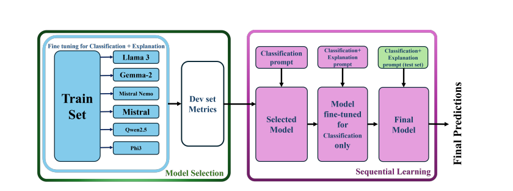

---

##### Download

+ [Paper](paper3.pdf)

---

##### Abstract

This paper presents the system description of our entry for the COLING 2025 FMD challenge, focusing on misinformation detection in financial domains. We experimented with a combination of large language models, including Qwen, Mistral, and Gemma-2, and leveraged pre-processing and sequential learning for not only identifying fraudulent financial content but also generating coherent, and concise explanations that clarify the rationale behind the classifications. Our approach achieved competitive results with an F1-score of 0.8283 for classification, and ROUGE-1 of 0.7253 for explanations. This work highlights the transformative potential of LLMs in financial applications, offering insights into their capabilities for combating misinformation and enhancing transparency while identifying areas for future improvement in robustness and domain adaptation.

---

##### Figure 



---

##### Citation

Jebish Purbey, Siddhant Gupta, Nikhil Manali, Siddartha Pullakhandam, Drishti Sharma, Ashay Srivastava, Ram Mohan Rao Kadiyala. "SeQwen at the Financial Misinformation Detection Challenge Task: Sequential Learning for Claim Verification and Explanation Generation in Financial Domains" arXiv preprint arXiv:2412.00549 (2024).

```BibTeX
@article{Purbey2024,
author = {Jebish Purbey and Siddhant Gupta and Nikhil Manali and Siddartha Pullakhandam and Drishti Sharma and Ashay Srivastava and Ram Mohan Rao Kadiyala},
year = {2024},
title = {SeQwen at the Financial Misinformation Detection Challenge Task: Sequential Learning for Claim Verification and Explanation Generation in Financial Domains},
journal = {arXiv preprint},
volume = {arXiv:2412.00549}
}
```

---

